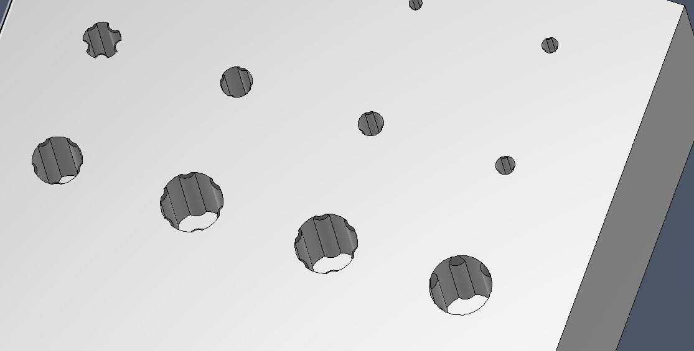

<p align="center">


</p>

<h1 align="center">ThreadMeister – Heat-Set Insert Add-in for Fusion 360</h1>

<div align="center">

</div>

<p align="center" style="max-width:600px; margin: 0 auto;">An add-in for Autodesk Fusion 360 that automates the creation of heat-set insert holes for 3D printing, using insert dimension recommendations from <a href="https://cnckitchen.com">CNC Kitchen</a>.</p>

<p align="center">
<strong>Extended fork</strong> of the original <a href="https://github.com/AndreasOKircher/ThreadMeister">ThreadMeister</a> by Andreas Kircher, with the addition of <strong>Grip Ridge</strong> insert holes.
</p>

## Features

* **Pre-configured insert sizes** - CNC Kitchen's recommended dimensions for common sizes (M2, M2.5, M3, M4, M5, M6, M8, M10, and 1/4"-20 camera thread)
* **Grip Ridge inserts** - Configurable multi-arc grip ridge holes for enhanced pull-out resistance (M1.6 through M10)
* **Blind holes and through holes** - Automatically calculates correct depths
* Automatic **top chamfer** (configurable size and angle)
* Automatic **bottom fillet** (configurable radius)
* **Multiple holes at once** - Select multiple sketch points to create several holes in one operation
* **Timeline grouping** - All operations grouped with descriptive names for easy management
* **Direct integration** - Holes are cut directly into your part, no manual combine operations needed
* **User-friendly interface** - Button in SOLID > MODIFY menu with intuitive dialog
* **Fully customizable** - All dimensions, chamfers, and grip ridge parameters editable via `config.ini`

<br>


<div align="center">  </div>

## Grip Ridge Inserts


Grip Ridge inserts add multiple arc-shaped ridges around the inner wall of the hole to provide a self-forming thread for screws in 3D printed parts while remaining strong, easy to print, and reasonably durable. The feature was inspired by **Made With Layers** (Thomas Salanderer) — href="<https://toms3d.org/2025/01/14/a-better-way-to-add-threads-to-your-3d-prints/>">see his original concept for the motivation behind grip-enhanced insert holes.</a>.</p>

<p align="center">

<div align="center">

</div>

<p align="center"><em>Grip Ridge holes at various sizes, showing the ridges that protrude into the bore to grip the screw.</em></p>

### Grip Ridge Specifications

Each Grip Ridge insert is defined by six parameters in `config.ini`:

| Parameter | Description |
|----|----|
| `clearance_dia` | Diameter of the central clearance hole (mm) |
| `hole_depth` | Default depth for the grip ridge hole (mm) |
| `grip_edge_chamfer` | Chamfer size on the top of each grip ridge arc (mm) |
| `grip_ridge_dia` | Diameter of each individual grip ridge arc circle (mm) |
| `grip_arc_distance` | Distance from hole centre to the centre of each grip ridge arc (mm) |
| `grip_count` | Number of grip ridges positioned equally around the hole |

| Insert Size | Clearance | Depth | Chamfer | Ridge Dia | Arc Distance | Count |
|----|----|----|----|----|----|----|
| M1.6 Grip | 1.8mm | 4mm | 0.2mm | 0.8mm | 1.075mm | 3 |
| M2 Grip | 2.2mm | 5mm | 0.23mm | 1.0mm | 1.35mm | 3 |
| M2.5 Grip | 2.7mm | 6mm | 0.23mm | 1.25mm | 1.725mm | 3 |
| M3 Grip | 3.2mm | 7mm | 0.28mm | 1.5mm | 2.05mm | 3 |
| M4 Grip | 4.2mm | 8mm | 0.33mm | 2.0mm | 2.75mm | 3 |
| M5 Grip | 5.3mm | 9mm | 0.37mm | 2.5mm | 3.5mm | 4 |
| M6 Grip | 6.3mm | 10mm | 0.42mm | 2.7mm | 3.5mm | 5 |
| M8 Grip | 8.3mm | 12mm | 0.5mm | 3.5mm | 5.3mm | 5 |
| M10 Grip | 10.3mm | 14mm | 0.6mm | 4.0mm | 6.45mm | 6 |

All values are fully editable in `config.ini` — add your own sizes or tweak existing ones. For clarity, I haven’t yet tested the clearances and strength of any of these Grip Ridge holes but they look about right to me, feel free to do some scientific testing to find the best balance of dimensions for your usage.

## Why ThreadMeisterExtended?

Tired of googling insert dimensions every time you need a bore for a heat-set insert? ThreadMeister has them built in — just pick your size and it creates the hole directly in your model. No more manual circle sketching, no more wrong depths, no more manual extrude cuts. ThreadMeisterExtended furthers this concept by allowing the quick and easy insertion of Grip Ridge holes to parts without the need for complex boolean operations or manually sketching the grip ridges.

## Platform Support

* **Windows**: Fully tested
* **macOS**: Expected to work; not yet fully verified due to lack of hardware
  * Code uses cross‑platform paths (`os.path.join`)
  * No Windows‑specific APIs
  * Icon loading and geometry creation should behave identically

## Installation

### Method 1: Manual Installation


1. Download this repository (Code → Download ZIP)
2. Extract the `ThreadMeisterExtended` folder
3. Copy the folder to your Fusion 360 Add-Ins directory:
   * **Windows**: `C:\Users\[YourUsername]\AppData\Roaming\Autodesk\Autodesk Fusion 360\API\AddIns\`
   * **macOS**: `~/Library/Application Support/Autodesk/Autodesk Fusion 360/API/AddIns/`
4. Restart Fusion 360
5. Go to **Utilities** → **Add-Ins** → **Scripts and Add-Ins** → **Add-Ins** tab
6. Find `ThreadMeisterExtended` and click **Run**
7. Optional: Check **Run on Startup** to load automatically

### Method 2: Git Clone

```bash
cd "C:\Users\[YourUsername]\AppData\Roaming\Autodesk\Autodesk Fusion 360\API\AddIns\"
git clone https://github.com/kiwimccomb/ThreadMeisterExtended.git ThreadMeisterExtended
```

## Usage

### Quick Start


1. **Create a sketch** and place **sketch points** where insert holes should be created.
2. **Finish the sketch**
3. Click the **"ThreadMeister"** button in **SOLID → MODIFY** menu
4. **Select your target body** (the part to add holes to)
5. **Select one or more sketch points**
6. Choose your **insert size** (e.g., M3 x 5.7mm standard, or M3 Grip)
7. Choose **Blind Hole** or **Through Hole**
8. Enable/disable top **chamfer** and bottom **fillet** (recommended: enabled)
9. Click **OK**

### Standard Insert Specifications

All dimensions follow CNC Kitchen's official recommendations:

| Insert Size | Hole Diameter | Insert Length | Min Wall Thickness |
|----|----|----|----|
| M2 x 3mm | 3.2mm | 3.0mm | 1.5mm |
| M2.5 x 4mm | 4.0mm | 4.0mm | 1.5mm |
| M3 x 3mm (short) | 4.4mm | 3.0mm | 1.6mm |
| M3 x 4mm (short) | 4.4mm | 4.0mm | 1.6mm |
| M3 x 5.7mm (standard) | 4.4mm | 5.7mm | 1.6mm |
| M4 x 4mm (short) | 5.6mm | 4.0mm | 2.0mm |
| M4 x 8.1mm (standard) | 5.6mm | 8.1mm | 2.0mm |
| M5 x 5.8mm (short) | 6.4mm | 5.8mm | 2.5mm |
| M5 x 9.5mm (standard) | 6.4mm | 9.5mm | 2.5mm |
| M6 x 12.7mm | 8.0mm | 12.7mm | 3.0mm |
| M8 x 12.7mm | 9.7mm | 12.7mm | 4.0mm |
| M10 x 12.7mm | 12.0mm | 12.7mm | 5.0mm |
| 1/4"-20 x 12.7mm | 8.0mm | 12.7mm | 3.0mm |

### Customize settings

Edit `config.ini` to adjust behavior. The file is located in the add-in folder. The config is organized into four sections:

`[Settings]` — Design parameters

| Parameter | Default | Description |
|----|----|----|
| `chamfer_size` | 0.5 | Top chamfer size in mm (45° chamfer) |
| `blind_hole_extra_depth` | 1.0 | Extra depth added to blind holes in mm |
| `bottom_radius_size` | 0.5 | Bottom fillet radius in mm (blind holes only) |
| `grip_chamfer_angle` | 60 | Chamfer angle for grip ridge arcs in degrees |

`[Inserts]` — Standard insert specifications

Each line defines an insert: `name = hole_diameter_mm, insert_length_mm, min_wall_thickness_mm`

`[GripRidgeInserts]` — Grip Ridge insert specifications

Each line defines a grip ridge insert: `name = clearance_dia, hole_depth, grip_edge_chamfer, grip_ridge_dia, grip_arc_distance, grip_count`

`[UI State]` — Remembered menu state (saved automatically between sessions)

`[Developer]` — Debug options

## Screenshots

<div align="center">  <br>
<strong>Easy configure hole according to insert spec</strong>

<br><br> <!-- spacing between images -->

</div> <div align="center">  <br>
<strong>Bore is associated with sketch dimensions and all features are grouped in the timeline</strong> </div>

## Requirements

* Autodesk Fusion 360
* Python support (built into Fusion 360)
* Windows or macOS

## Tips

* **Print orientation matters**: Test hole sizes for your specific printer and orientation
* **Wall thickness**: Always ensure adequate wall thickness around holes
* **Multiple holes**: Select multiple points to create several holes efficiently
* **Timeline**: All operations are grouped - you can easily undo or suppress the entire set

## Troubleshooting

**Button doesn't appear:**

* Make sure the add-in is in the AddIns folder (not Scripts folder)
* Restart Fusion 360
* Check that the add-in is running in the Add-Ins tab

**Inserts or holes are the wrong size:**

* Add your own insert specifications to the config file (or change existing definitions)

**Chamfer or fillet radius missing:**

* The chamfer and fillet radius can be selected in the config menu

**Grip Ridge chamfer not appearing:**

* Check the `grip_chamfer_angle` and `grip_edge_chamfer` values in `[GripRidgeInserts]`
* Enable logging (`enable_logging = True`) to see diagnostic output about edge detection

## Changelog

### v1.3.3 — 2026-06-16

* **Grip Ridge inserts** — full support for configurable multi-arc grip ridge holes
* Added `[GripRidgeInserts]` section to config.ini with 6 parameters per insert
* Grip ridge geometry fully customizable: ridge diameter, arc distance, grip count, chamfer size
* Per-insert chamfer sizes for grip ridges (e.g., M10 = 0.4mm, M3 = 0.19mm)
* Depth spinner now uses configured `hole_depth` directly (no more insert+extra+chamfer calculation)
* Credit: Grip Ridge feature inspired by **Made With Layers** (Thomas Salanderer)

### v1.2.2.10 — 2026-03-16

* Config.ini reorganized into 4 sections (`[Settings]`, `[Inserts]`, `[UI State]`, `[Developer]`)
* Improved error messages with per-point failure details
* Chamfer size now added to blind hole extrude depth (was missing before)
* Info text updates dynamically when toggling chamfer checkbox

### v1.2.2.9 — 2026-03-14

* Added privacy policy (required for Autodesk App Store)
* Added packaging script for App Store submissions

### v1.2.2.8 — 2026-03-14

* **Clean temp sketch approach**: bore circles are now created in a projection-free temporary sketch, eliminating profile selection failures caused by Fusion 360's auto-projected body edges
* Parametric association maintained — moving the original sketch point updates the bore automatically
* Temp sketches named `TM_{insert}_P{n}`, grouped in timeline
* User's original sketch is never modified

### v1.2.2.7 — 2026-03-13

* Added debug export and visualization tools for profile analysis
* Added curve-point filter to profile selection algorithm

### v1.2.2.6 — 2026-03-11

* Added pytest test suite (49+ unit tests, zero Fusion 360 dependency)

### v1.2.2.5 — 2026-03-10

* Split monolithic `ThreadMeister.py` into 6 focused modules (`core/tm_*.py`)
* Refactored `findProfileForCircle()` into testable sub-functions
* No functional changes — internal refactoring only

### v1.2.2.4 — 2026-03-07

* Switched license from GPL-3.0 to MIT
* Added animated GIF demo and README improvements

### v1.2.2.3 — 2026-02 — Initial public release

## Contributing

Contributions are welcome! Please feel free to submit issues or pull requests.

## Credits

* **Original project**: [ThreadMeister](https://github.com/AndreasOKircher/ThreadMeister) by [Andreas Kircher](https://github.com/AndreasOKircher)
* **Grip Ridge feature**: Inspired by [Made With Layers](https://www.madewithlayers.com/) (Thomas Salanderer)
* **Grip Ridge implementation**: Added to this fork (with significant AI assistance — it took many iterations to get the arc detection and chamfer logic right)
* **Insert specifications**: [CNC Kitchen](https://cnckitchen.com)
* **Code assistance**: CAI‑assisted coding using Perplexity / Claude / Qwen / Deepseek
* **Animation recorded with**: [ScreenToGif](https://www.screentogif.com)

## License

This project is licensed under the MIT License.
See the LICENSE file for details.

## Disclaimer

This add-in is not affiliated with or endorsed by CNC Kitchen, Autodesk, or Made With Layers. All insert specifications are publicly available from CNC Kitchen's documentation. Use at your own risk and always verify dimensions for your specific application.

## Support

If you find this add-in useful, consider:

* ⭐ Starring this repository
* Reporting issues or suggesting improvements
* Supporting [CNC Kitchen](https://cnckitchen.store) by purchasing their high-quality inserts


---

## Known Technical Limitations

### Through‑hole extrusion instability

Fusion 360 may fail to create through‑hole extrusions in certain situations. This typically occurs when the sketch or target body contains complex or ambiguous geometry that prevents Fusion from resolving a clean cut.

Symptoms include:

* Missing through‑hole cut
* Partial cut that stops before exiting the body
* "Profile not found" or "Operation failed" errors

Common causes:

* Complex or thin‑walled bodies
* Ambiguous extrusion direction
* Overlapping or poorly defined profiles

Workarounds:

* Simplify the geometry around the bore location
* Ensure the target body has clean, manifold geometry
* Move the bore point into a separate sketch


---

### Sketch profile overload (resolved in v1.2.2.8)

In earlier versions, ThreadMeister drew the bore circle in the user's existing sketch. If that sketch had many intersecting lines or Fusion's auto-projected body edges near the bore location, profile selection could fail.

Since v1.2.2.8, ThreadMeister creates a clean temporary sketch containing only the bore circle, eliminating this issue entirely.

## Privacy Policy

ThreadMeister does not collect, store, or transmit any personal data or usage information. All operations are performed locally within Autodesk Fusion 360. No data is sent to external servers, third parties, analytics tools, or advertising networks. No data retention or deletion policies are required as no data is collected. Since no data is collected, there is no consent to revoke or data to request deletion of.


---

**Happy 3D printing!** 🎉